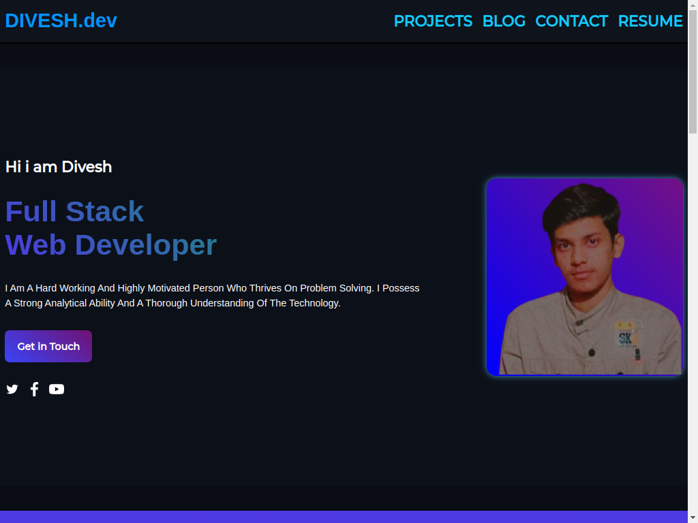

# Project 19 - with HTML and  CSS

by Divesh Thakre

 

[Deployed link ](https://diveshthakre.netlify.app/)

## what concepts i Learned by Creating this website?

- This project was minimal i used some flex-box.
- Gained confidence on css .
- learned to plan layouts.
- learned to position html elements.
- learned to make wensite responsive for all devices.
- working with text Gradients

### Time Taken For this project is around 8 hrs.
